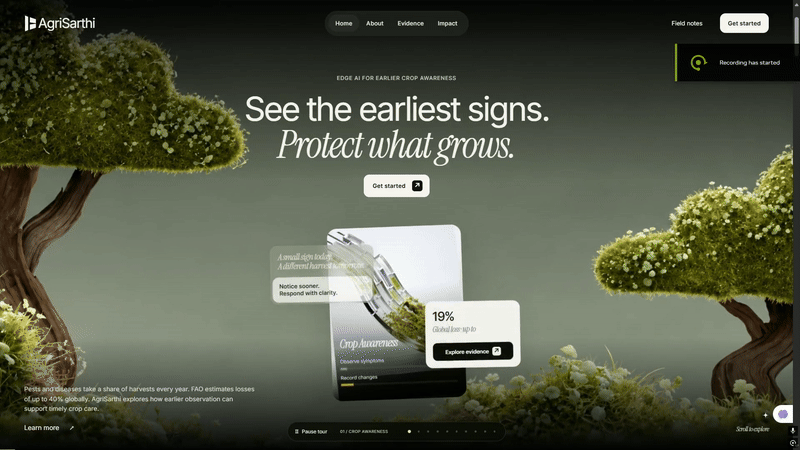
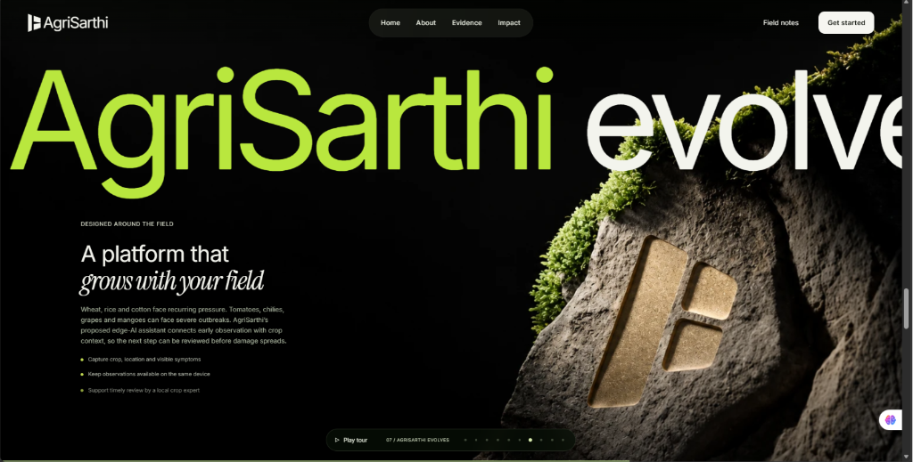
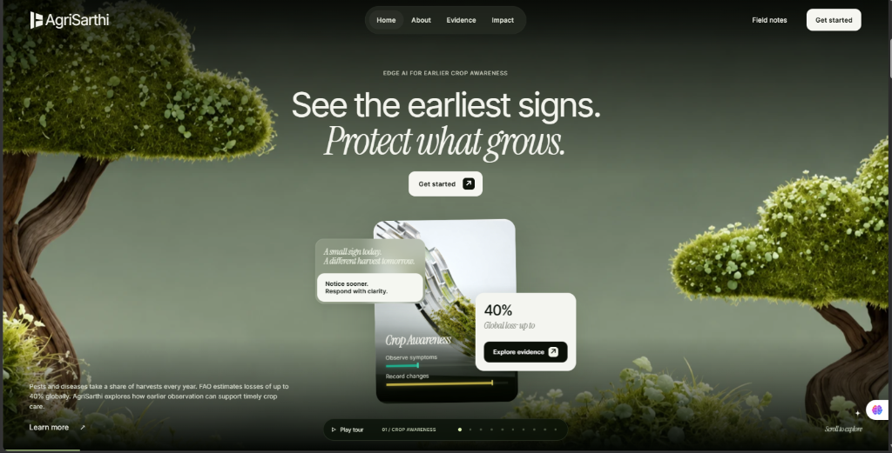

# AgriSarthi — Crop Awareness and Early-Detection Concept

> 🌐 **Live Website:** [https://agri-sarthi-lovat.vercel.app](https://agri-sarthi-lovat.vercel.app)  
> 📹 **Demo Video:** [Watch Full HD Video (MP4)](https://github.com/foxDev-code/Agri_Sarthi/raw/main/docs/assets/agrisarthi-demo.mp4)

A crop-protection platform and botanical web experience exploring edge-AI early crop awareness, pest and disease loss evidence, and guided local scouting.

---

## 🎬 Video Demonstration

https://github.com/user-attachments/assets/demo

<div align="center">
  <video src="https://github.com/foxDev-code/Agri_Sarthi/raw/main/docs/assets/agrisarthi-demo.mp4" controls="controls" muted="muted" style="max-width: 100%; border-radius: 10px; box-shadow: 0 4px 20px rgba(0,0,0,0.5);">
    Your browser does not support the video tag.
  </video>
</div>

<p align="center">
  <a href="https://github.com/foxDev-code/Agri_Sarthi/raw/main/docs/assets/agrisarthi-demo.mp4">
    
  </a>
  <br>
  <em>▶️ <b>Click the preview above to view or download the full 1080p demo video directly.</b></em>
</p>

---

## 📸 Interface Snips & Showcase

<p align="center">
  
  <br>
  <em>Hero Section — Early detection and crop protection awareness with real-time particle globe</em>
</p>

<p align="center">
  
  <br>
  <em>AgriSarthi Platform Evolution — Designed around field realities and crop context</em>
</p>

---

## 🚀 Live Demo & Deployment

- **Production URL:** [https://agri-sarthi-lovat.vercel.app](https://agri-sarthi-lovat.vercel.app)
- **Deployment Platform:** Vercel (Vite preset)
- **Status:** Continuous deployment on `main` branch

---

## 💻 Run Locally

Install a compatible Node.js runtime (Node 22.12+ in the 22 release line).

From this directory run:

```sh
node preview.mjs
```

Open `http://127.0.0.1:4173` (Windows users can also double-click `START-PREVIEW.cmd`).

To develop and rebuild:

```sh
npm install
npm run dev
npm run build
```

---

## 🌾 Content and Evidence

The hero and About scenes introduce recurring crop losses and earlier observation. Floating cards detail crop loss evidence: rice 37.4%, wheat 28.2%, maize 31.2%, and soybean 26.3%. Additional cards show reported tea-sector losses of 147 million kg and ₹2,865 crore annually.

Open **Evidence** in the navigation for every supplied project figure, scope, source links and uncertainty notes. `src/crop-evidence.js` contains that content.

---

## 🛠️ Working Interactions

- **Crop profile & field workspace**: Interactive notebook and guided scouting checklist.
- **Local observation notes**: Saved locally in the browser with text file download support.
- **Interactive choreography**: 10 distinct scenes with interactive tour controls and 3D globe animation.
- **Privacy & local control**: Clear local storage and preferences anytime via the built-in privacy dialog.
